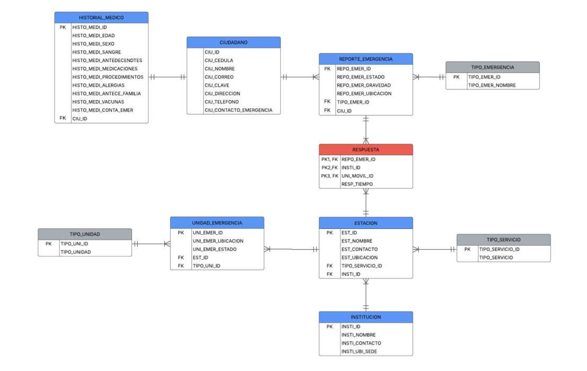
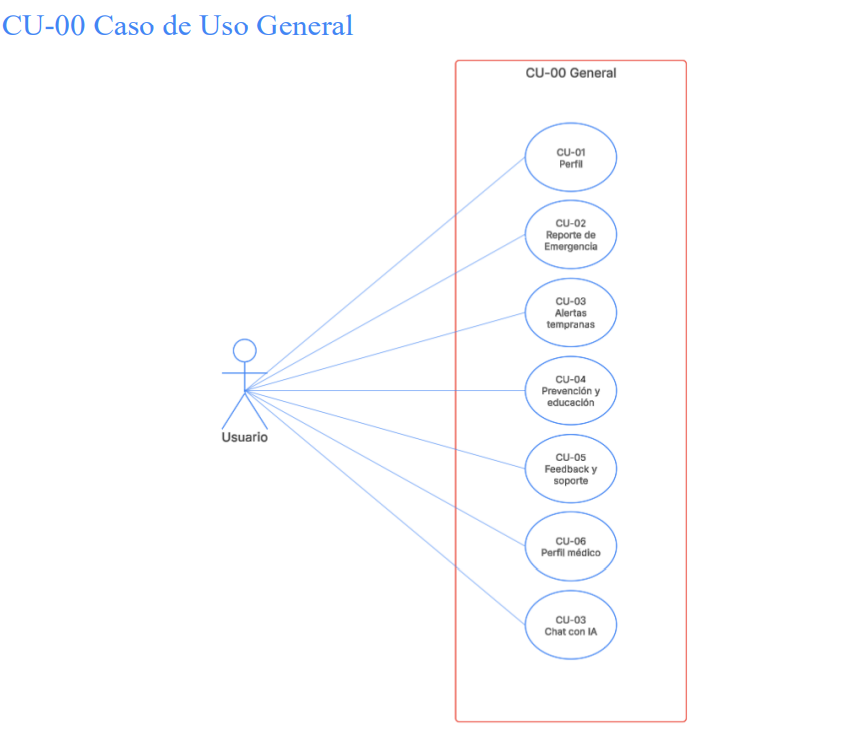
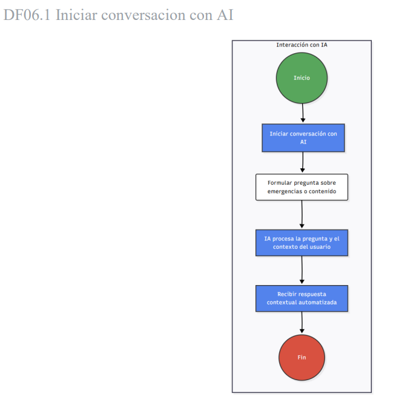
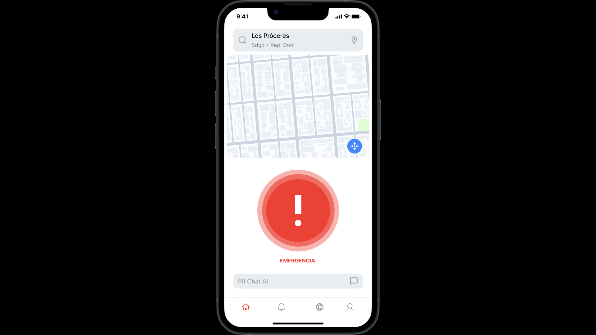
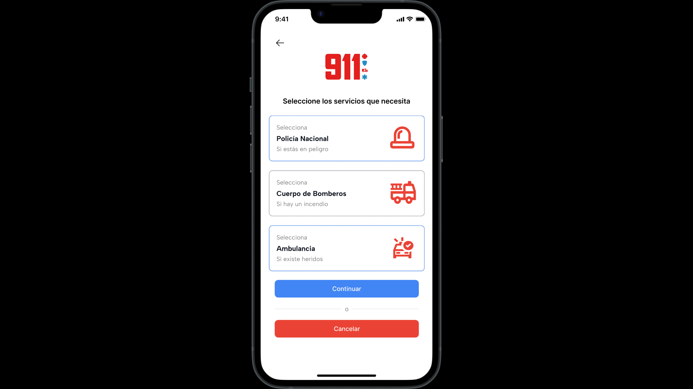
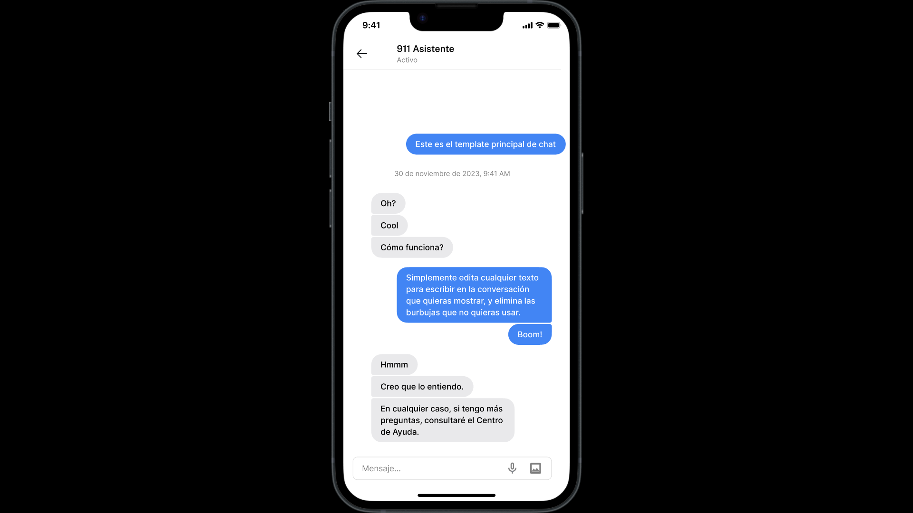

# 🚑 Red 911: Emergency Response System Architecture

> **A comprehensive System Design and Architecture Specification for a centralized emergency response platform in the Dominican Republic.**

*Note: This repository is a purely architectural portfolio piece. It showcases advanced requirements engineering, relational database modeling, and microservices design patterns.*

## 🏗️ Core Engineering Pillars

This system was designed to reduce dispatch times and optimize resource allocation through three main pillars:
1. **Microservices Architecture:** Decoupling the Identity, Dispatch, Early Warning, and AI Triage services to ensure high availability.
2. **Real-Time Geolocation:** Mapping logic for rapid response.
3. **Data Security (ISO 27001):** Specifications for AES-256 encryption on all sensitive medical and personal data.

---

## 🗄️ System Design & Modeling

Click on each section to expand the architectural diagrams and technical flows.

<b>1. Relational Database Schema (SQL)</b>

 
A highly normalized SQL schema designed to handle the complex relationships between citizens, emergency reports, medical profiles, and responding units.

 
**(Nota para ti: Sube la imagen de la página 25 de tu PDF aquí)**

<b>2. Global Use Cases & Actors</b>

 
UML Use Case mapping for 7 central modules, defining the interaction boundaries between the system and its users.

**(Nota para ti: Sube la imagen de la página 26 de tu PDF aquí)**

<b>3. AI Triage & Dispatch Flow (BPMN)</b>

 
Logical workflow for the AI Assistant, detailing the decision tree for automated triage and the escalation protocol to human operators.

**(Nota para ti: Sube la imagen de la página 21 de tu PDF aquí)**

---

## 🔒 Non-Functional Requirements (NFRs)
Engineered to meet critical public safety standards:
* **Performance:** `< 2 seconds` response time for critical dispatch operations.
* **Availability:** `99.95%` uptime design with offline report caching.
* **Security:** Strict adherence to Dominican Law 172-13 for data protection.

---

## 📱 UI/UX Proof of Concept
To validate the engineering workflows, a high-fidelity interface concept was designed. Here are the core screens:

  
  
  

*(Nota para ti: Aquí pones 3 pantallazos bonitos de tu Figma, uno al lado del otro)*